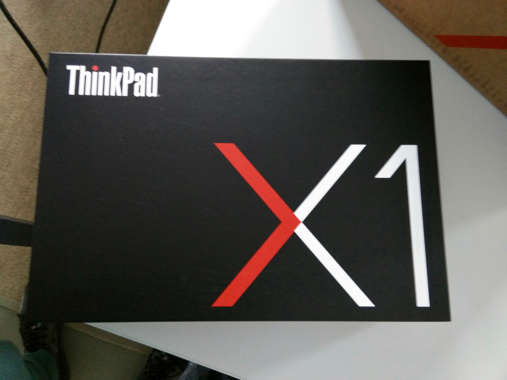
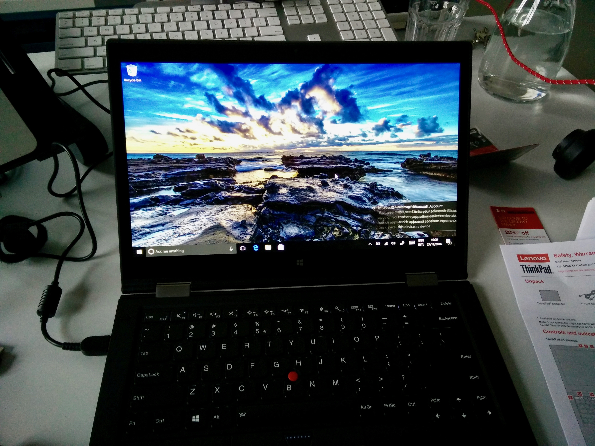
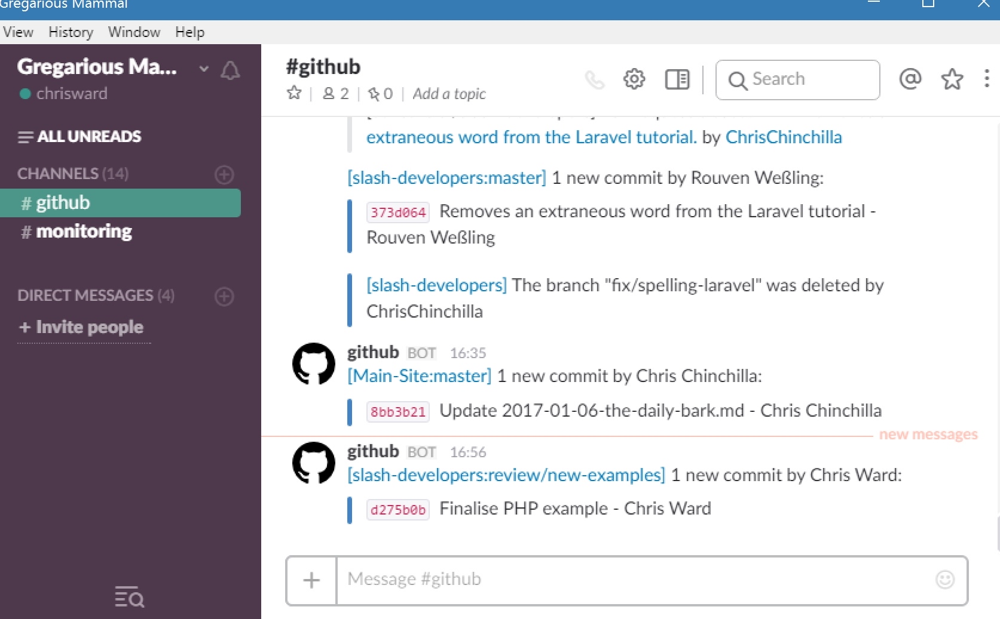
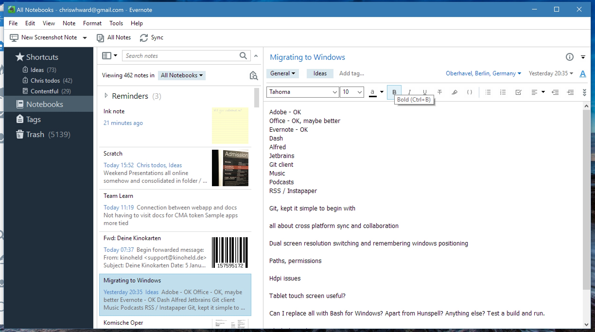
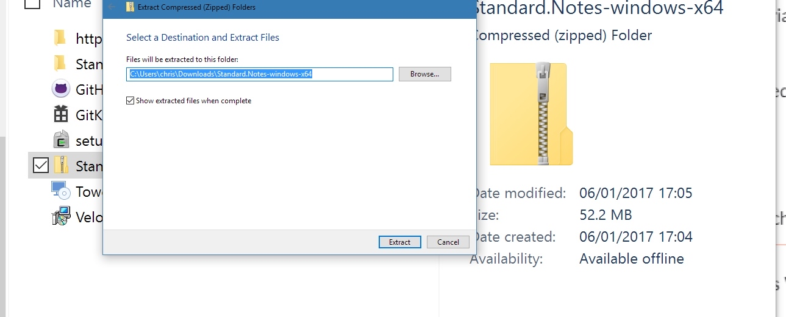

My first experience with computers was with my Dad's old Commodore business machine way back in 19clicketyclick. I played random text-based games and learnt a little BASIC. Fast forward a couple of years, and I was the owner of a shiny Amiga 1200, I played games, made music, wrote stories and loved every minute of it, all in glorious colour.

Years later, after finishing school, I acquired an [Apple Mac Performa 6200](https://en.wikipedia.org/wiki/Power_Macintosh_6200) (with the wonderful [OS 7.5](https://en.wikipedia.org/wiki/System_7)) and never looked back. Aside from a couple of forced dallies with Windows (at University) and Linux (at work) I have been a Mac user for over 20 years. During the bad times, and the good. I even worked in Mac support in the early 2000s, helping users through the hard roll-out of OSX, and much more.

All this changed in 2016\. After a series of announcements and releases from Apple, I jumped on the switcher bandwagon.

Let's get facts out of the way first. I didn't go cold turkey. I am still using my 2013 MacBook Pro for personal work, and I will upgrade it in 2017\. But work owed me a computer, so it was a perfect opportunity to dip my toes in the water of other operating systems, see what they offered, get new perspectives, and break down my assumptions.

This is the story of that journey so far.

## Pre-purchase

As an Apple user, you get used to having little choice over hardware and Software configuration. When you investigate the worlds of Windows and Linux machines, you're overwhelmed with choice. Choice is generally considered as a good thing, but a lack of choice often forces you to make a decision, and too much can make you become paralysed with indecision as you attempt to decide between configurations that have little differentiation.

When you do decide, unless you opt for one the growing array of Microsoft branded devices, then the purchasing experience isn't as slick as with Apple. After loving my experiences so far with the [Lenovo Yoga Book](http://127.0.0.1:4000/hands-on-with-the-yoga-book), I opted for a [Lenovo Thinkpad Yoga X1](http://shop.lenovo.com/Thinkpad/X1-Yoga)\. I figured that if I was going to wander off the Mac path, I might as well go all the way into form factors that Apple will never support.

I live in Germany, but wanted a QWERTY layout, with Apple this isn't typically a problem, and whilst Lenovo offered the option, it was a build to order option and took six weeks to arrive. I had forgotten I'd ordered the laptop until it arrived on Christmas Eve and I'd already left the office for holidays.

## Unboxing and setup

Most major computer manufacturers have upped their game when it comes to the un-boxing experience, and Lenovo is no different. Everything is well packaged in a gatefold red box, accompanied by a basic protective sleeve, cleaning cloth and a couple of essential adaptors (beat that Apple). Getting started with Windows is a far simpler process than it used to be, and the only confusion I had was my personal mix of using German unit formatting, American keyboard layout, and British spelling. This causes most of my computers confusion. Whilst I know that the new MacBook Pros have fingerprint readers, this was my first experience using one, and the setup was also smooth. After a few downloads and restarts, Windows was ready to go.

## Using Windows

I'm going to try to be constructive here and not complain about why I don't like something because I'm more used to macOS than Windows. Rather, these did or didn't work out for me.

### Display handling

One of my biggest frustrations with Windows has been display handling. This is one area that macOS excels in, yet Apple rarely promotes these small-but-amazing features of their operating system.

Setup of dual screens with Windows is as you would expect, and connecting to wireless displays is also straightforward. However, unlike macOS, Windows forgets window positions on each screen frequently, with them not remaining between restarts or even after the screen saver runs. Every morning I have to spend time redistributing application windows around my screens.

I can cope with this, as often I change my mind about where I want windows anyway, but my biggest gripe is the way Windows handles hi-resolution screens. Note that you won't notice what I'm talking about if you don't view these images on a hi-resolution screen.

This first example is from Slack running on the in-built (hires) screen:

Notice the horrible rendering inside the application window. The display control panel allows you to scale screen elements to make them readable to blind bats like me. But the text rendering in the app looks like this no matter what the setting in the control panel is.

After digging into this I found out that Windows puts responsibility for handling hires screens to the software developer, whereas macOS handles it for the developer. I guess this is a fundamental difference between the operating systems, one can rely on the hardware configuration it will run on, but the other runs on a myriad of different configurations.

Slack is built on top of [Electron](http://electron.atom.io/) (along with other applications that all suffer the same problem), and as it's an open-source project, it's unlikely that anyone has built in that support yet. As much as it pains me, I will give it leeway.

Here's a screenshot from Evernote, a native application:

Same problem. OK, maybe they have other priorities on their mind. But here's a screenshot from Windows itself:

And this wasn't the only example. If even Microsoft haven't built in support for hi-resolution screens into their operating system, why should 3rd party developers bother?

### Relaunch, restart, repeat

Applications and Windows wants to restart A LOT. Make settings change, windows wants to restart. Install an update, Windows wants to restart. It used to be like this with macOS, but typically these days it's only when you add low-level features. I shut down my MBP once a week purely for psychological reasons, but I don't need to. I am assuming this has something do with the kernel-based architecture of macOS, but I guess Windows works in a fundamentally different way. It's bearable but puts you off experimenting with settings too much.

### Touch and tablet mode

I ventured down the Windows path as I had enjoyed the 2-in-1 experience on my tablet, and wanted to see how it felt on a computer. Flipping the laptop back and forth to switch modes works well, and the stylus I found lurking in a side compartment is perfectly suited to doodling on the screen. This is an area where Windows 10 excels. Microsoft have done a good job of getting this dual purpose polished in Windows 10\. However, I wonder how much I will use the mode in reality, and also how many applications are optimised for the experience. I guess time will tell.

### Working in a cross-platform world

One of the reasons I was interested in trying alternatives to macOS, was to spend time out of the walled garden that Apple constructs. Microsoft has been making great steps to be more open and welcoming to all platforms, and I was interested in seeing how well they accomplished this. At some levels, they have done a fantastic job. Office integrates well with a variety of cloud storage solutions, and has mobile apps that are usable. Windows now includes basic applications to get you started such as Mail and Calendar that will suit many normal computer users. But I found developing on Windows a major pain, despite the new Bash support, and attempting to follow the advice of my peers.

Granted this is a problem that relates specifically to me and those who work in similar fields. If you don't need to collaborate on coding projects in mixed environments with macOS and Linux users, then this won't bother you. But I do, and it caused major issues, remember, Linux also includes most hosting, CI, and testing tools.

I constantly have to change path variables, which after fiddling, wasn't so much of a problem. My bigger issue was with line endings and permissions in text files, and that files with Windows style line endings would break automated builds, tests, and more. I tried all sorts of settings in editors, IDEs and git to enforce non-Windows line endings, but something kept overriding them, and I was constantly changing them.

One of the best aspects of macOS is that it's this curious mix of GUI, but with a Unix-like core. Apple touches this occasionally, introducing extra steps to get it working, removing pre-installed packages (e.g. Apache) or not pre-packaging the most up-to-date packages (Git, Bash). But mostly, there are easy workarounds for this (the amazing [Homebrew](http://brew.sh/)), and you can generally run the same packages as Linux users.

With Windows, I didn't know where to start. There are roughly three Homebrew equivalents (including the [new Bash support](https://msdn.microsoft.com/en-us/commandline/wsl/about)) and multiple terminal replacements, but I still struggled to fulfil all my dependencies with one. Depending on what worked best for me, or availability, I have tooling installed from native packages, others in [Cygwin](https://www.cygwin.com/), and others in Bash for Windows. This gets incredibly confusing when it comes to environment variables, dependencies, or tracking down the source of problems such as my issue with line endings. Of course there are workarounds, but there comes a point when workarounds outweigh your productivity, and I was getting to that point.

## Look through any window

For 'normal' users, Windows is a solid operating system, and if you never touch development processes (and remember, I am a writer) or develop Microsoft technologies, then it's a fine choice. If you are into games, it's one of the best choices. I haven't even tried installing my backlog of Steam games I can't play on my Mac yet. There are lots of applications only available on Windows, especially enterprise level applications.

I enjoyed the level of control you have with Windows, the settings you can tweak in default control panels exceeds the capabilities of Linux. I like the new Start menu and what you can do with it. Whilst Cortana is limited outside the USA, it's better integrated into the OS than Siri on Mac.

I can live with my development issues noted above, whilst they are a hit to my productivity, my setup will always be peculiar to me, and it's not a mainstream use case. What I find inexcusable are the display issues noted above, I find it hard to understand how Microsoft is encouraging hi-res displays when the user experience with them is mostly terrible. After most days working with Windows I had a headache, I think due to the font rendering in a lot of applications.

That's my tale with Windows, not all bad, but hard to get along with. Next week I try Linux, so watch this space.
